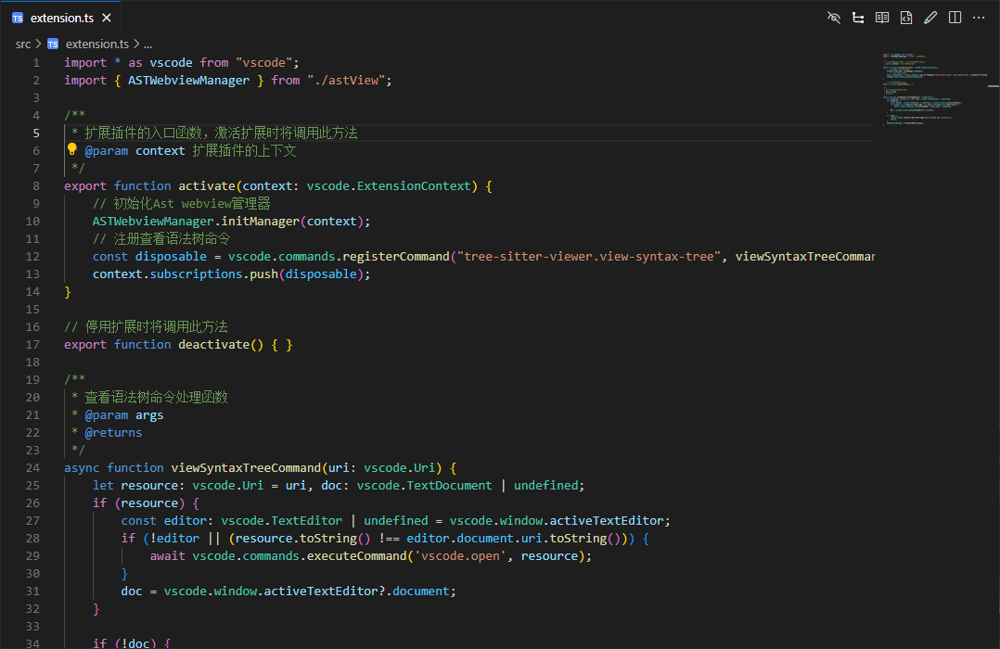

# tree-sitter-viewer 

这是一个类似于 `Tree-sitter` 官网[`游乐场`](https://tree-sitter.github.io/tree-sitter/7-playground.html)的`VS Code`扩展插件。  
您可以使用该插件方便的查看不同开发语言的抽象语法树，插件支持的语言与 `Tree-sitter` 官网 `游乐场` 保持一致。

## 功能演示

## 已知问题

https://github.com/xiaonatuo/tree-sitter-viewer/issues

## 版本发布

### 1.0.0
初始版本发布。

## 更多信息

* [Github](https://github.com/xiaonatuo/tree-sitter-viewer)

**Enjoy!**
